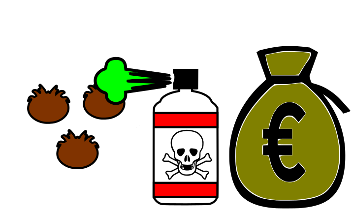
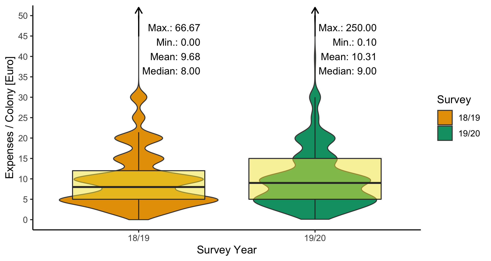
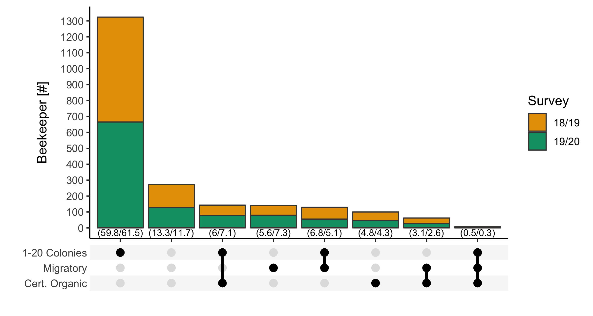
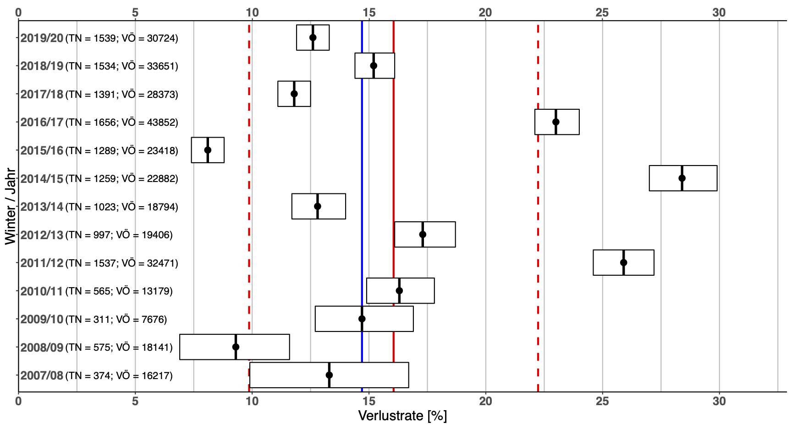
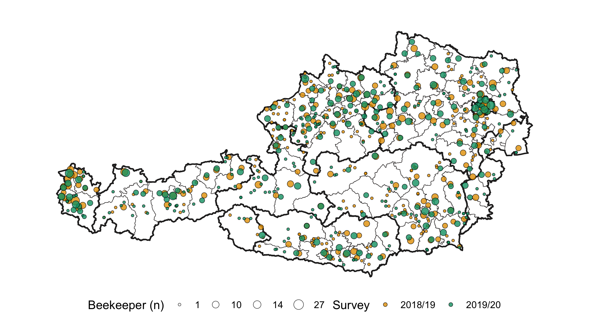

class: inverse, middle



```{r cache=FALSE, load_refs, include=FALSE}
# library(RefManageR)
# library(here)
# BibOptions(
#   style = "text",
#   first.inits = T,
#   max.names = 2
# )
# myBib <- ReadBib("ref.bib")
```

.footnote[Presentation: Hannes Oberreiter, version: 2021-04-12]

---
class: left, middle

## Beekeeper Crowdsourcing Data
### Analysis of varroacide expenses and honey bee colony winter mortality on operation level in Austria


**Hannes Oberreiter** 

Institute of Biology, University of Graz

```{r setup, include=FALSE, warnings=FALSE}
options(htmltools.dir.version = FALSE)
```

???
- Comparing Expenses and Efficiency of Treatment Methods against the introduced Varroa Mite.
- work in progress

---
class: middle, inverse

--
### Why?

- Imported aggressor *Varroa destructor*
  - High varroa mite infestation ~ greatest potential to raise winter colony losses (Morawetz, et al. 2019)
- Varroa control methods
  - Differ in effect and usage distribution (Oberreiter and Brodschneider, 2020)
- Novel descriptive analysis of treatment expenses

???
- Varroa seems to be main driver of colony losses over winter
- Method vary in their effectiveness
--

### How?

- Cooperation with the yearly colony loss survey
- Crowd sourced data of three winters

```html
Question:
* Estimated treatment expenses per colony without labor costs?
```
???
- part of the yearly survey
- one new questions

---
class: inverse
## Index
.left-column[
### 1. DS
]
.right-column[

### Descriptive Statistics

1. Quantitative Numbers

2. Central Tendencies of Survey Expenses

3. Distribution of Cohorts

4. Estimate of Expenses (Input Validation)

]

???
- biggest part in surveys is input validation
- DS is the main point of the study as in my opinion it is not fair game to test a hypothesis on data you explore

---
class: animated
### 1 DS
#### 1.1 Quantitative Numbers

- ~ 4% of registered beekeepers<sup>*</sup>

<br/>
<table>
<thead>
<tr class="header">
<th align="left">Year</th>
<th align="center">Survey [n]</th>
<th align="center">Answered <br/>Expenses [n]</th>
<th align="center">Percent [%]</th>
</tr>
</thead>
<tbody>
<tr class="odd">
<td align="left">18/19</td>
<td align="right">1.534</td>
<td align="right">1.195</td>
<td align="right">77.9</td>
</tr>
<tr class="even">
<td align="left">19/20</td>
<td align="right">1.539</td>
<td align="right">1.170</td>
<td align="right">76.0</td>
</tr>
</tbody>


.footnote[<sup>*</sup>Compared to the number of registered beekeeper and honey bee colonies with the national beekeeping association Biene Österreich]

???
- in the survey participate around 4% of the population in question
- not all survey participants did answer the expenses question
- not all had access to the question (paper, newspaper shorter questionnaire)

---
class: animated, 
### 1 DS
#### 1.2 Central Tendencies of Survey Expenses



???
- two years are similar
- most participants did answer in full numbers (shape of violin plot)

---
class: animated
### 1 DS
#### 1.3 Distribution of Cohorts



???
- Combination of answers plays a big part in my survey to separate into cohorts
- shown are the three factors which I picked from the survey which would make sense to influence the expenses
- Hobby VS professional colony size and possible migratory
- organic beekeeper, they are only allowed to use a subset of treatment methods
- both years strikingly similar ? mostly same participants?

---
class: animated, 
### 1 DS
#### 1.4 Estimate of Expenses (Input Validation)


.center[Yellow = Mean, Blue = 2 x Standard Deviation [95%]]

???
- in my input validation calculated estimated expenses
- treatment combinations of at least 15 n
- negative difference -> we overestimated the expenses in mean
- positive underestimated for formic acid short term and long term
- info: log2 +1 is double of original, -1 half of original 

---
class: inverse
## Index

.left-column[

### 1. DS
### 2. EDA

]
.right-column[

### Exploratory Data Analysis

1. Single Factor

2. Extrapolation of total Expenses

]

???
- next up factor analysis
- as mentioned picked a few factors which may influence the expenses
- now we look at them ! not in combination tough

---
### 2 EDA
#### 2.1 Single Factor

--
- Operation Size

  - Hobby Beekeeper spend **more** (< Colonies)
  - No difference between medium and large Operations <br/>
  (20-50, >50 Colonies)
  - ~5 Euro / Colony difference (Median)
  
???
- bigger operation spend less on average less euros per colony
- no real difference above 21 colonies
- effect size is low
--

- Migratory Beekeeper

  - spend **less**
  - ~3-4 Euro / Colony difference (Median)
  - without treatment effect, no difference in survey 18/19

???
:::::::::::::::::::
- migratory beekeeper, possible a good indicator for "professionals"
- migratory beekeeper lower expenses

--

- Certified Organic Beekeeper

  - spend **less** 
  - ~4 Euro / Colony difference (Median)
  - without treatment effect, low effect size

???
:::::::::::::::::::
- as for certified organic beekeeping operations, I did no analyse No Answers or Uncertain (which was only a minority)
- Certified on average lower expenses per colony
- only allowed to use a subset of treatment methods
- strict documentation of treatments
- effect is the other way around if we remove the effect of treatment methods


---
class: animated, 
### 2 EDA
#### 2.2 Extrapolation of Total Expenses


???
- we saw that small operations spend more on average
- extrapolated on mean shows that even though they do not keep most of the colonies in Austria they still spend a lot more
- big jump between the years as the count number did change a lot
- this are really rough estimates as I took the survey distribution, I do not have data on the population distribution
- if I use the total mean without cohorts the total expenses are higher around 20%. Cannot say at the moment which method shows the more "real" estimate


---
name: mylastslide
class: inverse
## Index

.left-column[

### 1. DS
### 2. EDA
### 3. ToDo

]
.right-column[

### Summary

- First investigation of varroa treatment related costs
- Novel description of the economics behind the mite agent sector

#### Outlook:

- Survey 2020/21
- Cost-benefit analysis including winter loss rate of honeybee colonies
- (Decision Tree Generation)

]

???
- this analysis has not done before
- already shows the financial impact of imported aggressor

- the master thesis is still in progress
- I also will add the survey from previous winter
- with the analysis, we may show a possible selection criteria for beekeepers 
- thinking about a decision tree for lower cost and higher cost

---

# Appendix

---
class: center, middle

## History of Winter Colony Losses in Austria

.center[]

.center[Red = Running Average + SD, Blue = Median, TN = Participants, VÖ = Colonies]
.center[Source: 2020 Zukunft Biene 2 ]

???
- background info
- the yearly colony loss survey - carried out since winter 2007/08
- done by Crailsheim and Brodschneider
- loss rates not the same for each following year

---
class: animated
## Participants geographical Distribution



???
- distribution of main wintering apiary shows good coverage over all of Austria

